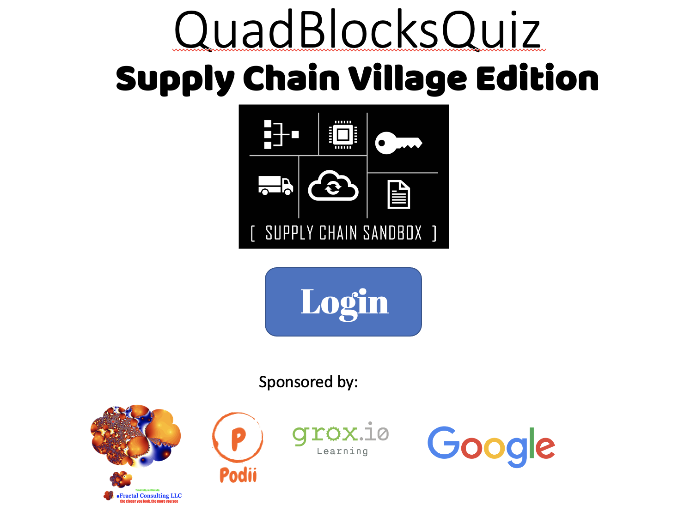
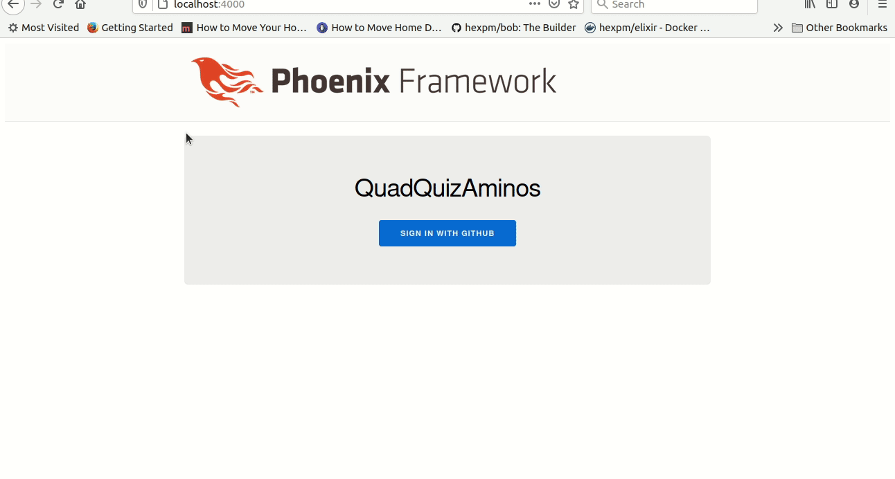
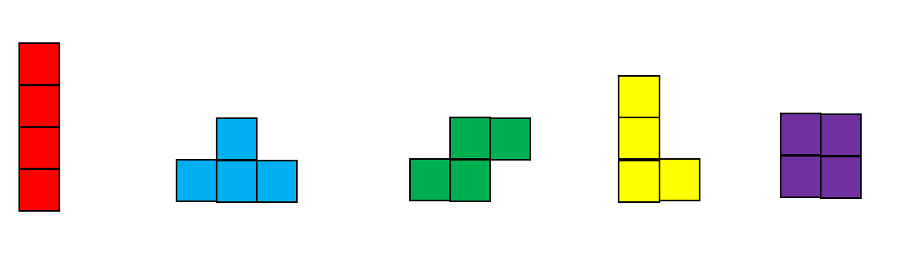
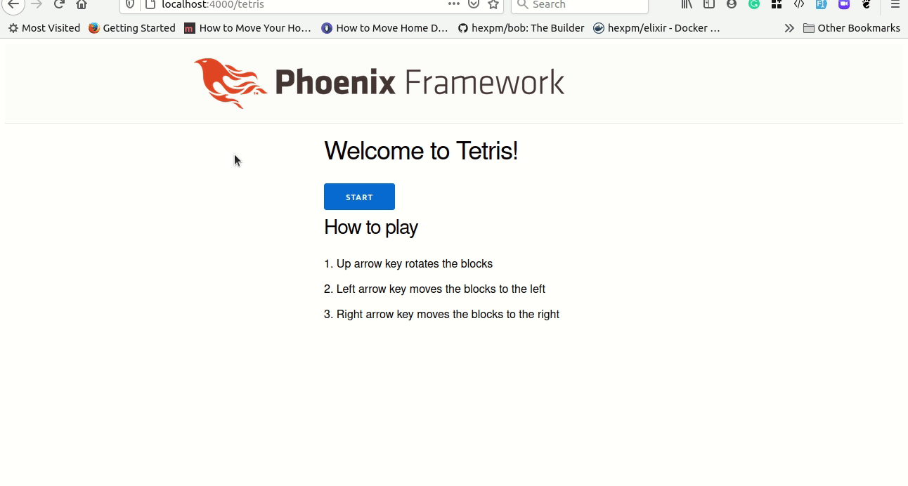
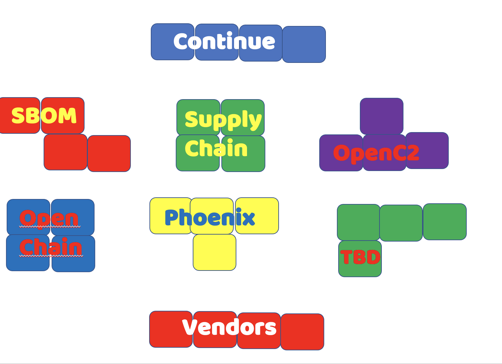

# QuizQuadBlocks - Supply Chain Village Edition
QuizQuadBlocks is a tetris-like game
that is part Tetris and part trivia quiz.
Being honest, the trivia is to educate on
supply chain.

## 1. Getting started
This instance authenticates using GitHub
(see here for more) therefore you mush have a GitHub ID
and the conference organizers must have added you to
the authorized list.
If you are not yet authorized, see *here* for more info.

Clicking on login will authenticate with Github.

**replace this with current example**

## 2. Playing

QuadBlocks or Tetrominoes
are shapes made from 4 squares.
In this game there are
.

QuadBlocks fall from top of screen

Their fall is influenced by:
- Clicking the left-arrow key moves the quadblock one block to the left
- Clicking the right-arrow key moves the quadblock one block to the right
- Clicking the up-arrow key rotates the block one quarter turn

**replace this with current example**

## 3. Objective
To score the most points
- Points accumulate with each tick of the clock
- Completed rows are removed and add points (in addition to letting you play longer)
- Answering questions add points as well as potentially giving powerups
- Game ends when the quadblocks pile up and reach the top of the playing area

## 4. Pausing / Questions
Typing the space bar pauses the game

A topic screen is displayed,
allowing the player to either continue back to the game
or answer questions for points and powerups

**replace this with current example**

## 5. Topics / Power-ups

### 5.1 Supply Chain
- This is the supply chain sandbox so obviously everything is about supply chain.
- Questions in this section are historical and misc.
- Answering incorrectly loses points and you remain paused until you answer correctly
- Answering correctly gets you points.

### 5.2 SBOM
- Software Bill of Materials is a critical element in supply chain risk management for both licenses and for vulnerabilities. It is also useful for software architecture (who needs 10 different modules with 27 different versions – all to perform the same function).
- More information at https://www.ntia.gov/sbom
- Answering incorrectly loses points and you remain paused until you answer correctly.
- Answering correctly gets you points and a ‘bomb’ powerup which allows you to ‘blow up’ one block (and if you answer enough SBOM questions, blow up an entire row)
