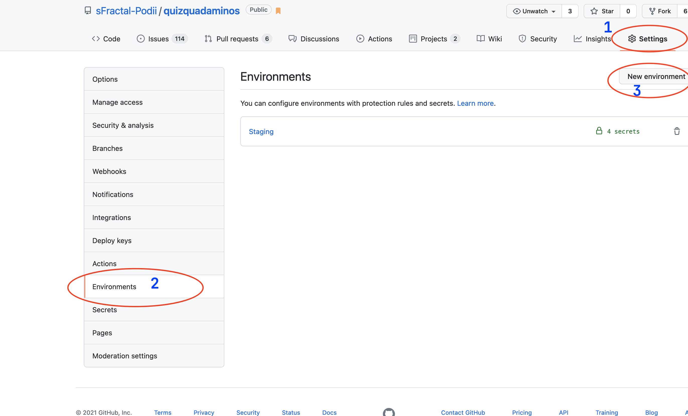
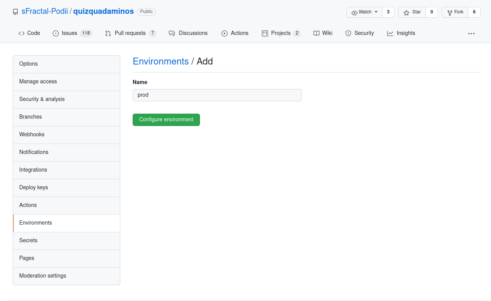
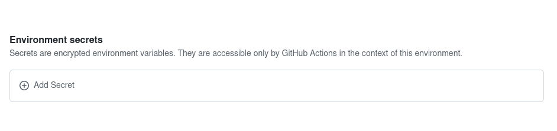
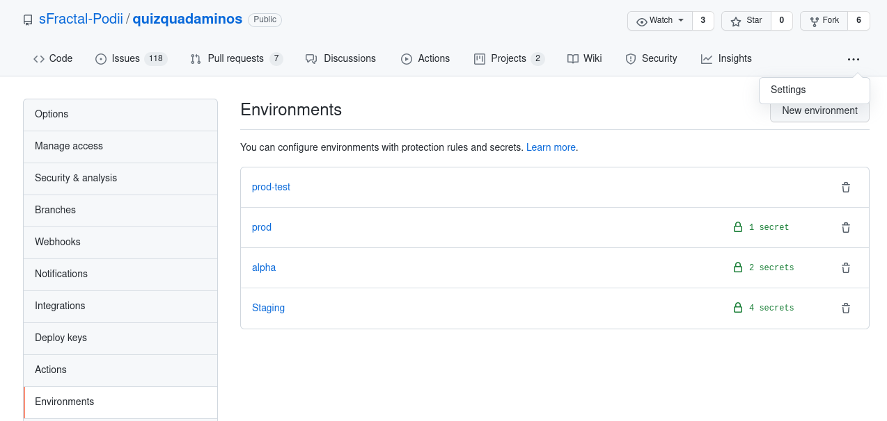

## Deployment to GCP
The deployment is done using docker images with the help of make tasks. We can create a docker image, push it to container registry on gcp and then launch an instance using this docker image.

The docker image is automatically tagged with the application version from your mix file

### Deployment from local machine
**Before you begin:**
- Make sure you have write access to the docker registry
- You will need the necessary permissions to create an instance
- Docker should be installed in your computer and running
- GCloud should be well set up, authenticated and initialised to use docker
- access to production secrets in the `releases.exs` file (look at `config/releases.sample.exs` to see an example)


#### creating an image for use in your laptop
If you want to create a docker image for use in your laptop then you can use the command
```shell
make docker-image
```
Note that the image tag will be build off the latest github tag if not specified.
You can specify the image tag by passing `APP_VERSION`

```shell
make docker-image APP_VERSION=v1.0.2
```

#### Creating an image and pushing to GCP
You can optionally create an image on your laptop and push it up to GCP container registry using the following command
```shell
make push-image-gcp
```
This will create the image and tag it with the latest github tag then push the created image to GCP.
You can specify github tag you want to tag the image with by passing `APP_VERSION`

```shell
make push-image-gcp APP_VERSION=v1.0.2
```

#### creating an image and lauching an instance on GCP
You can also run a server on GCP using the docker image by running the following command
```shell
make push-and-serve-gcp instance-name=<give-the-instance-a-unique-name>
```

If you had created an image before and would like to create a running server using the image run:
```shell
make deploy-existing-image instance-name=<give-the-instance-a-unique-name>
```

The instance name you provide above should be unique and should not be existing on GCP already otherwise you will get an error

#### updating a running instance
If you want to update an already running instance with a different version of the application, you need
to ensure that the image is created and pushed to gcr.io using `make push-image-gcp` after which you can update an instance to use the image.

This is done by specifying the tag to the image you want to use (`image-tag`) and the running instance you want to update
(`instance-name`)

```shell
make update-instance instance-name=<existing-instance-name> image-tag=<existing-tag-on-gcr>
```

An example would be:
```shell
make update-instance instance-name=testinstance image-tag=0.5.0
```

### Accessing from GCP
The above procedures create an instance of this project on GCP with the name you gave it.
Using console.cloud.google.compute, go to your virtual machine instances,and look up the external ip (a.b.c.d5) of the instance you just created (if you used one of the make commands then the ip address will be listed upon successful startup of the instance).
Note the phoenix webserver is running on port 4000
Go to http://a.b.c.d:4000/
Note it is http not https


#### updating a running instance
If you want to update an already running instance with a different version of the application, you need
to ensure that the image is created and pushed to gcr.io using `make push-image-gcp` after which you can update an instance to use the image.


#### Auto deployment
The auto deployment is done using CI and CD configuration.Every push on github is tested before being merged to develop.It is then deployed to staging servers automatically.

#### Setting Up a CI
Create a workflow file,lint-elixir.yml.The file contains scripts that define the different jobs that need to be done by creating a build.
The different jobs include:
- init
- lint
- test
- deploy
Through the Continuous Integration, the following commands are executed:
   - mix compile --warnings-as-errors
   - mix format --dry-run --check-formatted
   - mix validate.questions
   - mix credo --strict

#### Continuous Delivery
This is an extension of continuous integration since it automatically deploys all code changes to staging server after the build stage.It is an automated release process and you can deploy your application anytime by clicking a button.


## Deployment strategy
All work merged into the develop branch are automatically pushed to the staging server


### Deployment to Staging
This is automatically done whenever we merge/push into the develop branch.
We also have an environment setup on github for the staging secrets

### Deployment to Alpha and Production

Deployment to both servers is almost identical, only difference is that you create tags ending with `-alpha` for alpha deploys

To deploy to alpha you create a tag starting with `v` ending with the word `-alpha`, this will kick off an auto deployment to the alpha server.

To deploy to production you create a tag starting with `v` followed by a valid `major.minor.patch` sementic versioning format  for example `v0.1.2`. Valid tags for production are `vx.x.x` where x is any number


#### Adding deployment secrets
If you need to specify the secrets to be used for this environment:


1. create a github environment called alpha (we already have one for this project)

   Here are steps to follow when creating github environment
   
   

   After configuring environment, head over to adding environment secrets
   

   If the github environment already exists, go to settings -> Environment and update the
   environment if need be.
    


2. On this environment ensure we have the following secrets
  - COURSES_ANSWERS :: contains answers to all the courses questions
  - QNA_ANSWERS  :: contains all the answers for the qna directory
  - GCE_INSTANCE :: the  name of the gce instance we are to  deploy alpha to
  - RELEASES_SECRETS :: the releases.exs file containing secrets specific to the alpha environment.


