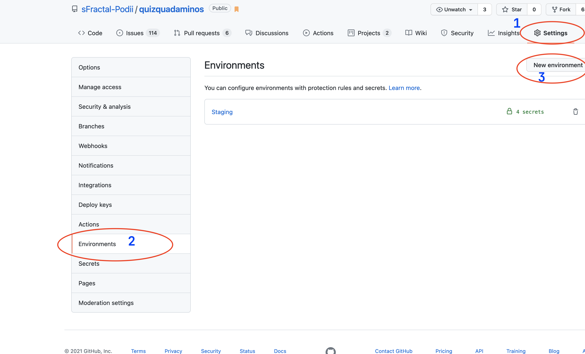
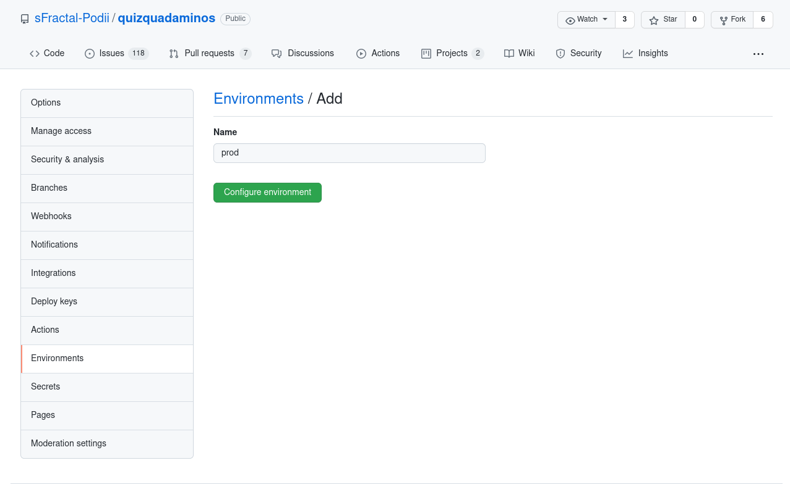
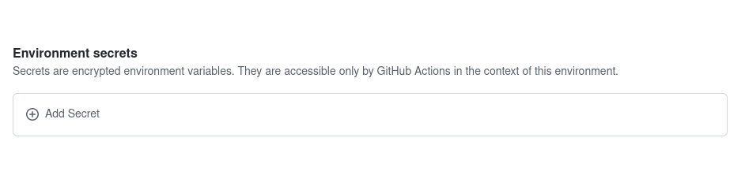
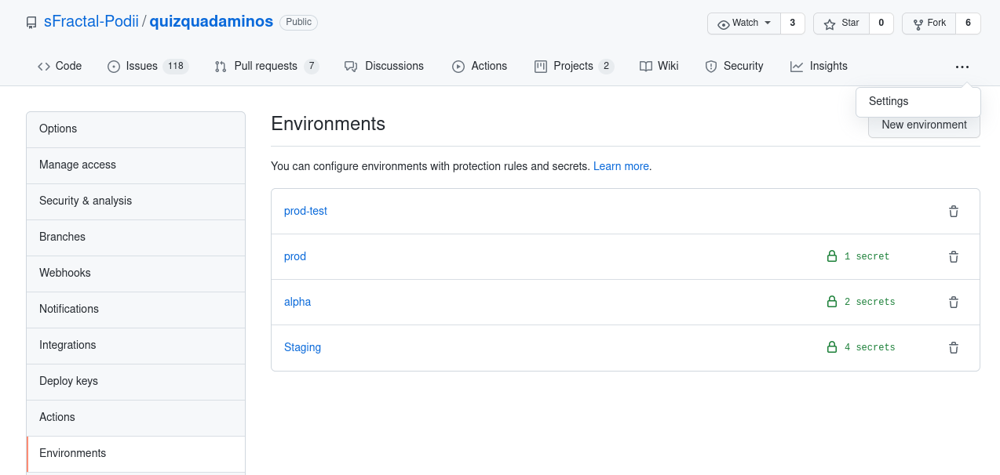

## Deployment to GCP

All deployments happen in various environments depending on certain conditions. We can have three deployment environments

| environment | tag                                                         |
| ----------- | ----------------------------------------------------------- |
| Staging     | no tags needed but app version on mix must end with v\*-dev |
| Alpha       | v\*-alpha                                                   |
| Production  | v\*                                                         |

We automatically deploy to GCP depending on the tag that you create. The tags here being git tags which can be created via git command or easily through the
[releases section](https://github.com/sFractal-Podii/quizquadaminos/releases) on github

### Auto deployment

The auto deployment is done using CI and CD configuration.Every push on github is tested before being merged to develop.It is then deployed to staging servers automatically.

#### Setting Up a CI

Create a workflow file, `lint-elixir.yml`.The file contains scripts that define the different jobs that need to be done by creating a build.
Through the Continuous Integration, the following commands are executed:

- mix compile --warnings-as-errors
- mix format --dry-run --check-formatted
- mix validate.questions
- mix credo --strict

#### Continuous Delivery

This is an extension of continuous integration since it automatically deploys all code changes to staging server after the build stage.It is an automated release process and you can deploy your application anytime by clicking a button.

## Deployment strategy

### Deployment to Staging

All work merged into the develop branch are automatically pushed to the staging server as long as the mix file version ends with `-dev`

We also have an environment setup on github for the staging secrets

### Deployment to Alpha and Production

Deployment to both servers is almost identical, only difference is that you create tags ending with `-alpha` for alpha deploys

To deploy to alpha you create a tag starting with `v` ending with the word `-alpha`, this will kick off an auto deployment to the alpha server.

To deploy to production you create a tag starting with `v` followed by a valid `major.minor.patch` sementic versioning format for example `v0.1.2`. Valid tags for production are `vx.x.x` where x is any number

#### Adding deployment secrets

If you need to specify the secrets to be used for this environment:

1. create a github environment called alpha (we already have one for this project)

   Here are steps to follow when creating github environment
   
   

   After configuring environment, head over to adding environment secrets
   

   If the github environment already exists, go to settings -> Environment and update the
   environment if need be.
   

2. On this environment ensure we have the following secrets

- COURSES_ANSWERS :: contains answers to all the courses questions
- QNA_ANSWERS :: contains all the answers for the qna directory
- GCE_INSTANCE :: the name of the gce instance we are to deploy alpha to
- RELEASES_SECRETS :: the releases.exs file containing secrets specific to the alpha environment.
